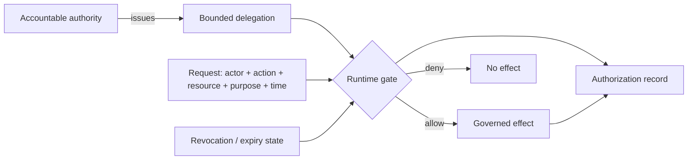
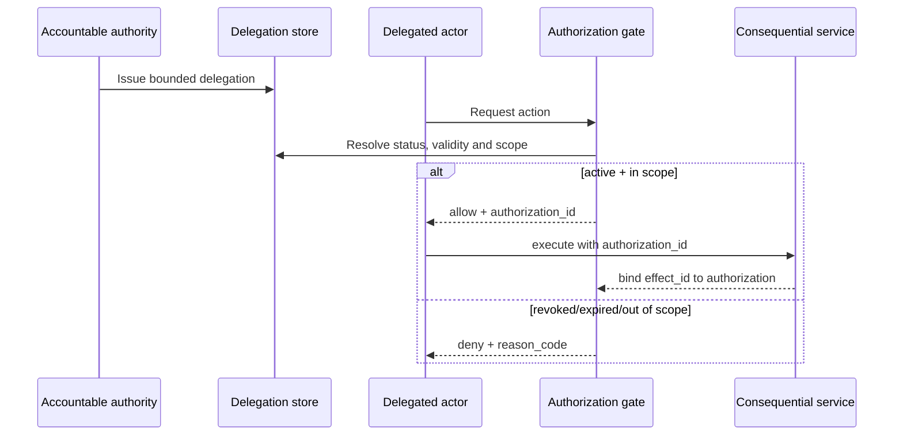

# Bounded delegation and runtime authorization

`CAP-AUTHORITY-BOUNDED-DELEGATION` requires consequential automated actions to resolve to a named authority, an explicit delegation envelope, a runtime authorization decision, and revocation semantics that take effect before the governed action is executed.

{: .warning }
This package does not create delegation authority. It standardizes how an adopting system can represent, evaluate, revoke, test, and evidence a delegation created by its own accountable authority.

## Control model

The gate MUST fail closed when the delegation is revoked, suspended, not yet valid, expired, or outside actor/action/resource/purpose scope.

## Machine-readable surfaces

- `schemas/governance/bounded-delegation.schema.json` defines the delegation envelope.
- `schemas/governance/runtime-authorization-record.schema.json` defines the evidence record produced by a runtime decision.
- `test-vectors/governance/bounded-delegation.yaml` defines positive and negative conformance vectors.
- `tools/validate_bounded_delegation.py` executes the vectors deterministically.

## Decision sequence

## Required implementation evidence

A deployment claiming this capability should preserve at minimum:

1. an authority map identifying the accountable delegator;
2. the versioned bounded delegation record;
3. the runtime authorization record for each consequential request;
4. evidence that effects can be correlated to the authorization that permitted them;
5. negative-test results for revoked, expired, and out-of-scope requests; and
6. a revocation test proving a pre-effect revocation prevents execution.

## Assurance boundary

Passing the repository vectors demonstrates conformance to this reusable decision model. It does not demonstrate that the delegator was legally entitled to delegate, that the policy was substantively correct, or that a specific deployment has implemented the package correctly. Those claims remain deployment- and authority-specific and require evidence-backed verification.
