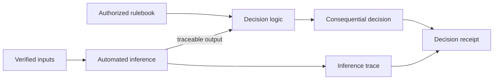
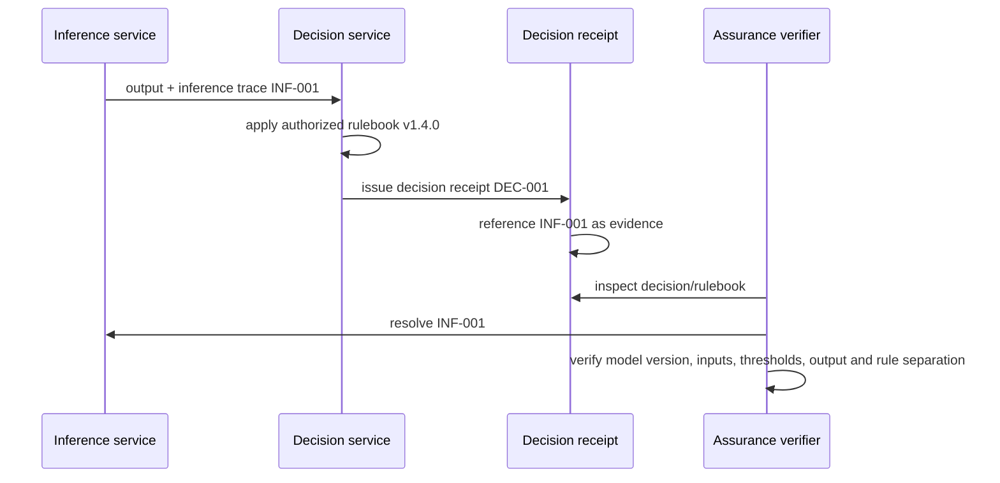

# Inference traceability

Use this capability when a consequential decision depends materially on a model, matcher, classifier, score, ranking function, or other automated inference.

The purpose is **not** to make the model the source of authority. The purpose is to make the automated transformation reconstructable while preserving the normative rule as a distinct authority source.

## Governance boundary



A risk score, probability, classification or ranking **must not silently become the legal or policy rule**. The decision trace should show both the inference and the authorized rule that determined how it could be used.

## Evidence object

`schemas/governance/inference-trace.schema.json` records:

- decision and trace identifiers;
- inference/model identity and immutable version;
- artifact digest;
- decision-time input snapshot references and hashes;
- thresholds and decision-relevant parameters;
- output/confidence;
- the permitted normative role of the inference;
- rulebook/version reference;
- trace integrity evidence.

## Decision receipt binding



The inference trace may be stored separately from the decision receipt so implementations can control disclosure and evidence retention independently. The receipt should contain a stable evidence reference that can be resolved during audit, appeal or re-evaluation.

## Required failure behavior

A high-consequence workflow should fail validation or assurance when:

- no immutable inference version is recorded;
- the stored model digest does not match the decision-time artifact;
- a decision-relevant threshold differs from the recorded configuration;
- input snapshots cannot be bound to decision-time evidence;
- the inference is represented as the normative rule itself;
- the trace points to a different decision.

Run the reference vectors with:

```bash
python tools/validate_inference_trace.py
```

## Provenance

This reusable capability was promoted from `coverage: none` because the same implementation gap appeared in four independent reviews in corpus `digital-statecraft-dpi-2026-wave1`:

- DS-TRACE-002
- DS-TRACE-003
- DS-TRACE-004
- DS-TRACE-005

Recurring gap class: `unbound_automated_inference`.

## Authority

This artifact makes inference evidence portable. It does not determine whether a particular model is lawful, accurate, fair, or authorized for a deployment. The adopting authority remains responsible for that determination and for defining the normative rule governing use of the inference.
