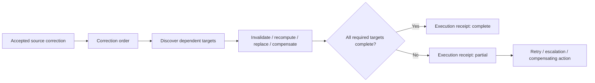
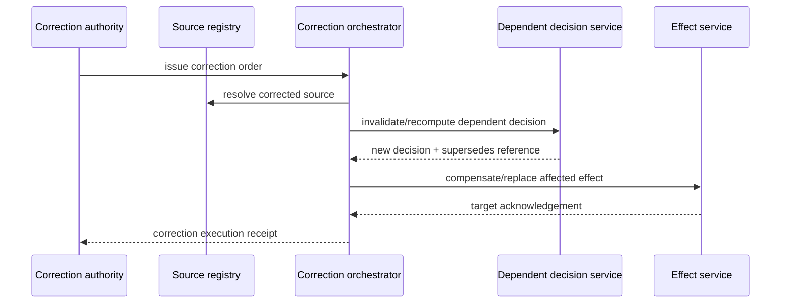

# Correction propagation

A successful correction is not complete when a source registry accepts a change. If downstream decisions or effects relied on the superseded fact or decision, the correction must propagate through the dependency chain and produce evidence of what changed and what remains unresolved.

## Lifecycle

The existing registry correction request/response schemas remain the source-correction interface. This capability begins after a correction is authorized and turns it into downstream execution.

## Evidence chain

## Completion rule

An execution receipt must not claim `complete` while a mandatory target is failed, pending or omitted. Partial execution is evidence, not success; unresolved targets must remain visible and route to retry, escalation or compensating action.

## Provenance

This capability was evidence-derived from corpus `digital-statecraft-dpi-2026-wave1`, reviews DS-TRACE-002, DS-TRACE-005 and DS-TRACE-006, recurring gap class `non_executable_correction_propagation`.

## Authority

The artifacts represent an authorized correction and its execution. They do not decide whether the underlying correction is legally warranted. That authority remains with the adopting registry, appellate, judicial or other competent institution.
