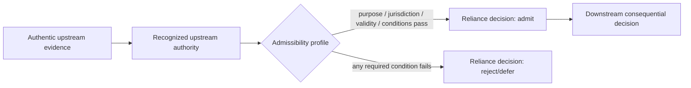
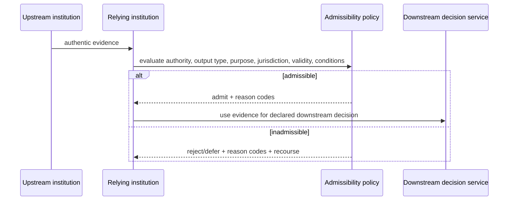

# Inter-institutional admissibility

Cryptographic verification can establish that evidence is authentic and identify its issuer. It does **not** by itself establish that a receiving institution is entitled to rely on that evidence for a particular downstream decision.

This capability represents the relying institution's adopted reliance policy and the decision to admit or reject an upstream output in a specific context.

## Trust-to-reliance boundary

Authenticity is therefore necessary but not sufficient.

## Reliance decision sequence

## Core artifacts

- `schemas/trust/admissibility-profile.schema.json` expresses the adopted reliance conditions.
- `schemas/trust/reliance-decision.schema.json` records the relying institution's decision at runtime.
- `test-vectors/trust/interinstitutional-admissibility.yaml` tests authentic-but-inadmissible evidence, wrong purpose/jurisdiction, expiry, revocation and missing assurance conditions.

## Authority and legal boundary

An admissibility profile does **not create legal admissibility**. It records a policy or authority decision made by the adopting institution. Whether that institution is legally permitted or required to rely on an upstream output remains a jurisdictional and institutional matter outside this repository.

## Provenance

This reusable capability was derived from recurring TRACE findings in corpus `digital-statecraft-dpi-2026-wave1`, specifically DS-TRACE-001 and DS-TRACE-006, recurring gap class `undefined_downstream_admissibility`.
