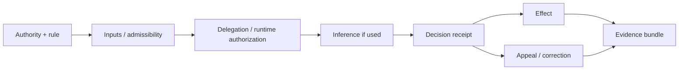

# Implementation recipes

Start here when you know **what you are building** but do not yet know which `CAP-*` identifiers or repository files you need.

These recipes compose existing reusable artifacts. They do not create deployment authority, legal admissibility, certification, or approval.

## Choose by build intent

| I am building… | Start with | Add when applicable |
| --- | --- | --- |
| A consequential eligibility, entitlement or approval service | decision receipt + evidence closure | delegation, admissibility, inference trace, redress, correction |
| A delegated agent or automated actor | bounded delegation + runtime authorization | decision receipt, evidence closure |
| Cross-institution evidence reliance | admissibility profile + reliance decision | decision receipt, redress |
| A model-assisted consequential decision | inference trace + decision receipt | delegation, admissibility, evidence closure |
| An appeal/correction/remedy workflow | redress workflow + correction interfaces | correction propagation + evidence closure |
| A system preparing for TRACE verification | evidence bundle + audit trail + conformance declaration | all capability-specific evidence |

## Recipe 1 — Consequential decision service

Use this for eligibility, entitlement, prioritization, denial, approval, suspension, payment or another outcome that materially affects a person or organization.

### Minimum artifact set

1. `schemas/decision-receipt.schema.json`
2. `controlled/assurance/evidence-bundles.md`
3. `schemas/minimum-audit-trail.schema.json`
4. `schemas/trace-conformance-declaration.schema.json`

### Add controls based on the architecture

- delegated actor: `schemas/governance/bounded-delegation.schema.json` + `schemas/governance/runtime-authorization-record.schema.json`
- upstream institutional evidence: `schemas/trust/admissibility-profile.schema.json` + `schemas/trust/reliance-decision.schema.json`
- model/inference contribution: `schemas/governance/inference-trace.schema.json`
- appeal: `schemas/redress/redress-workflow.schema.json`
- authoritative fact correction: `schemas/registry-correction-request.schema.json` + `schemas/registry-correction-response.schema.json`
- downstream correction: `schemas/redress/correction-order.schema.json` + `schemas/redress/correction-execution-receipt.schema.json`

### Instantiation order



### Minimum negative tests

- missing or invalid authority;
- stale rule version;
- authentic but inadmissible evidence where reliance is cross-institutional;
- revoked/out-of-scope delegate where automation is delegated;
- model/version/threshold mismatch where inference is used;
- effect without decision/authorization correlation;
- unavailable appeal for a contestable adverse outcome.

### Ready-for-verification evidence

- authority map;
- versioned decision rule;
- decision receipt(s);
- any applicable authorization, reliance or inference records;
- effect correlation;
- negative-test results;
- evidence manifest and hashes;
- residual limitations.

## Recipe 2 — Delegated agent or automated actor

Use this when software acts on behalf of an institution or another actor.

### Files

- `schemas/governance/bounded-delegation.schema.json`
- `schemas/governance/runtime-authorization-record.schema.json`
- `test-vectors/governance/bounded-delegation.yaml`
- `controlled/governance/bounded-delegation.md`

### Required implementation inputs

- delegator/accountable authority;
- delegate identity;
- permitted actions/resources/purposes;
- effective time window;
- revocation/suspension source;
- runtime authorization decision point;
- downstream effect correlation.

### Must-fail tests

- action outside scope;
- purpose outside scope;
- revoked delegation;
- expired/not-yet-valid delegation;
- effect created without valid runtime authorization.

A static delegation record is not sufficient. The critical enforcement point is the **runtime decision before effect**.

## Recipe 3 — Cross-institution evidence reliance

Use this when one institution consumes evidence, credentials, facts or outputs issued by another.

### Files

- `schemas/trust/admissibility-profile.schema.json`
- `schemas/trust/reliance-decision.schema.json`
- `test-vectors/trust/interinstitutional-admissibility.yaml`
- `controlled/trust/interinstitutional-admissibility.md`

### Required implementation inputs

- upstream authority/output type;
- relying institution;
- downstream decision;
- permitted purpose;
- jurisdiction/policy domain;
- assurance conditions;
- validity/revocation state;
- recourse/dispute path.

### Must-fail tests

- cryptographically authentic but inadmissible evidence;
- wrong purpose;
- wrong jurisdiction/domain;
- expired profile;
- revoked/suspended reliance permission;
- unmet assurance condition;
- missing reliance decision for a consequential action.

Authenticity answers **“is this evidence what it claims to be?”** Admissibility answers **“may this relying institution use it for this decision?”** They are different controls.

## Recipe 4 — Model-assisted consequential decision

Use this when a score, classifier, matcher, ranking model, LLM or other automated inference contributes to a consequential outcome.

### Files

- `schemas/governance/inference-trace.schema.json`
- `test-vectors/governance/inference-trace.yaml`
- `controlled/governance/inference-traceability.md`
- `schemas/decision-receipt.schema.json`

### Required implementation inputs

- model/algorithm identifier;
- immutable version/artifact digest;
- execution time;
- input snapshot references/hashes;
- decision-relevant parameters/thresholds;
- output;
- declared normative role;
- rulebook/decision-policy reference;
- decision receipt correlation.

### Must-fail tests

- unversioned inference;
- model or digest changed after decision time;
- threshold mismatch;
- missing input binding;
- inference output represented as the normative rule;
- inference trace bound to a different decision.

The model may provide evidence or a recommendation. It does not silently become the authority or the rule.

## Recipe 5 — Appeal, correction and remedy

Use this when an affected party or authorized institution must be able to contest an adverse decision, correct source facts, and propagate the resulting change.

### Base files

- `templates/redress/redress-workflow.md`
- `schemas/redress/redress-workflow.schema.json`
- `controlled/redress/redress-and-remediation.md`
- `schemas/registry-correction-request.schema.json`
- `schemas/registry-correction-response.schema.json`

### For downstream propagation

- `schemas/redress/correction-order.schema.json`
- `schemas/redress/correction-execution-receipt.schema.json`
- `test-vectors/redress/correction-propagation.yaml`
- `controlled/redress/correction-propagation.md`

### Required implementation inputs

- accountable redress/correction authority;
- intake and notice channel;
- response/escalation timelines;
- source fact or decision being contested;
- downstream dependency set;
- required action per target: invalidate/recompute/replace/compensate;
- completion/failure/retry semantics;
- resulting decision/effect references.

### Must-fail tests

- no reachable redress authority;
- unauthorized correction issuer;
- mandatory dependent target omitted;
- recomputation not performed;
- superseded outcome remains active;
- partial failure silently marked complete.

## Recipe 6 — Prepare for TRACE verification

A system is ready to return to the Lab when the team can supply evidence, not merely assertions.

### Minimum evidence package

- system/profile version;
- authority and delegation records;
- policy/rule versions;
- relevant decision receipts;
- capability-specific runtime records;
- positive and negative test results;
- incident/redress/correction results where applicable;
- `schemas/minimum-audit-trail.schema.json`-compatible audit evidence;
- `schemas/trace-conformance-declaration.schema.json`-compatible declaration;
- artifact hashes/provenance;
- residual risks/non-claims.

## Minimum viable governed service

For many consequential DPI/AI services, a practical starting composition is:

```text
accountable authority
  + versioned rule/policy
  + bounded runtime authority (if delegated)
  + admissibility decision (if external evidence)
  + inference trace (if model-assisted)
  + decision receipt
  + effect correlation
  + appeal/correction path
  + evidence bundle
```

Do not add components mechanically. Use only the capabilities implicated by the system's actual authority, decision, evidence and harm surfaces.

## Pre-production checklist

Before a governed service is described as implementation-ready, confirm:

- [ ] accountable decision authority is named;
- [ ] delegated authority has explicit scope and revocation;
- [ ] runtime enforcement points are identified;
- [ ] external evidence has an explicit reliance/admissibility rule where needed;
- [ ] model inference is traceable and separate from normative policy;
- [ ] adverse outcomes have an effective redress path;
- [ ] authoritative correction can reach mandatory downstream dependencies;
- [ ] positive and negative tests execute deterministically;
- [ ] evidence can be independently inspected and correlated to effects;
- [ ] residual risks and limitations are documented.

A completed checklist is a readiness signal, not certification. TRACE verification should evaluate the produced evidence against the relevant gap acceptance criteria.
